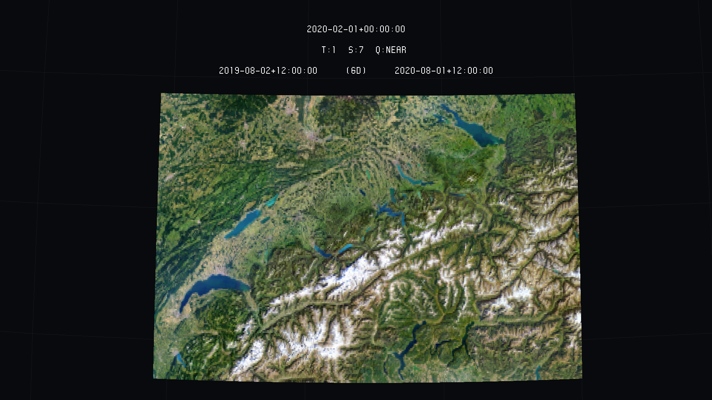
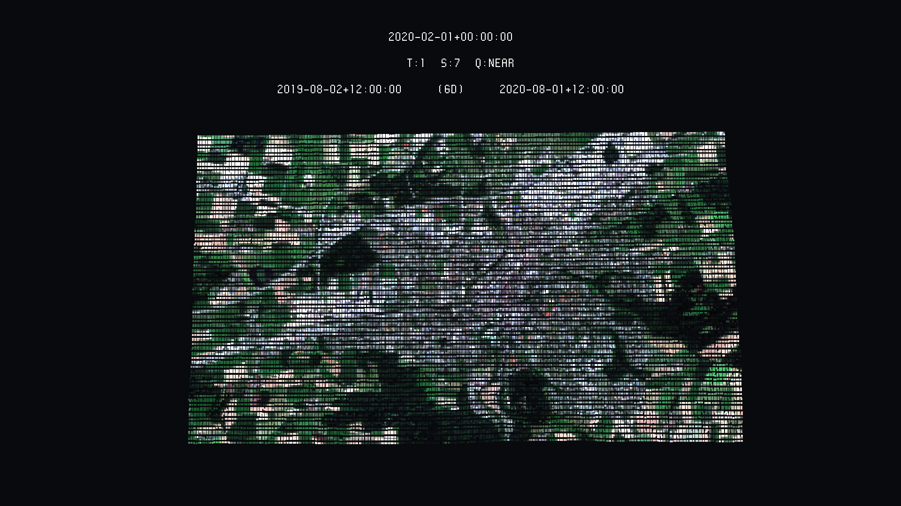
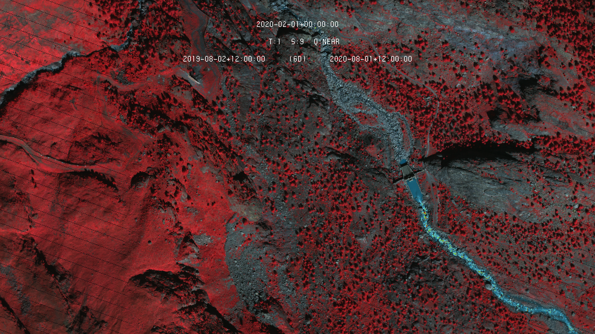
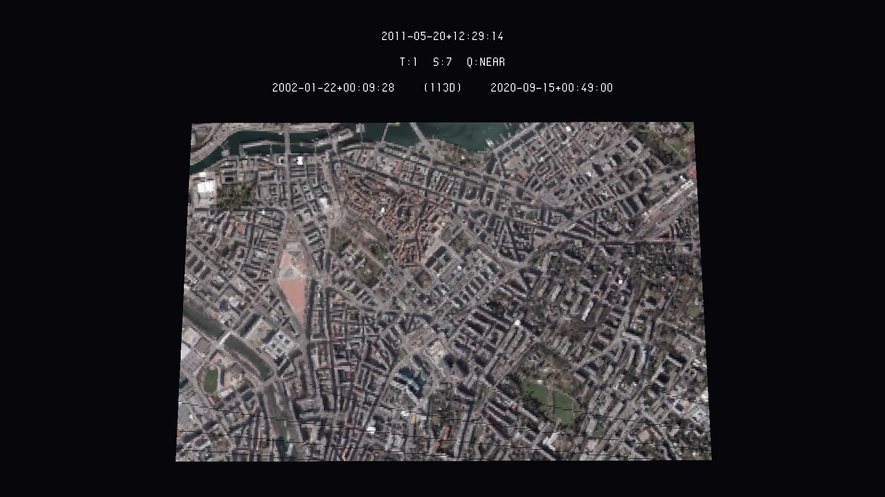
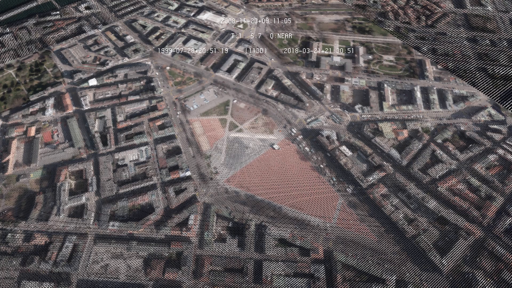

# Overview

This code converts RGB geotiff into the UV3 file format. The most important is that the file input file must be georreferenced in the WGS84 Coordinate System, as geotiff, and it must contain the three RGB bands (Red, Green and Blue). The reading is done through GDAL, and it is pretty quick for converting even big files. 

This code should work with multispectral imagery as well, though, as it only works with 8 bit files, in chase you have 16 bit (or even other) some conversions are needed. For that, we recommend you to use gdal directly in your terminal, as in the example below.

```
$ gdal_translate -of GTiff -ot Byte -scale 0 65535 0 255 /home/usr/path/to/input_geotiff.tif /home/usr/path/to/converted_geotiff.tif
```

## rgb-from-geotiff

Open the terminal where this code was cloned or downloaded (with cd path/to/directory) and use:

```
$ python3 rgb-from-geotiff.py -i /home/user/path/to/geotiff.tif -o /home/user/path/to/output.uv3
```

Input GeoTiff and output uv3 are the main possibilities, though if you want to work with false-colour raster, you may want to replace the band being analysed by another. For example, if you are working with NIR (Near Infrared) imagery, usually the red band is replaced by the NIR band. If the NIR band was the first one (1), and followed by red (2), green (3) and blue (4), one can do this replacement with the *red*, *green* and *blue* arguments, as in the code below:

```
$ python3 rgb-from-geotiff.py -i /home/user/path/to/geotiff.tif -o /home/user/path/to/output.uv3 -r 1 -g 3 -b 4
```
## Examples

Following there are some injections in the Eratosthene platform of RGB imagery. The first example is the landsat of Switzerlands area.



Another low resolution example is the Sentinel Imagery in Frauenfeld's area.



An example with SWISSIMAGE RS, which has a NIR band too.



Finally, to conclude those examples with high resolution data, this is an image from SITG, in Geneva's Downtown.




# Copyright and License

**rgb-from-geotiff** - Huriel Reichel, Nils Hamel <br >

# Copyright and License
Copyright (c) 2020 Republic and Canton of Geneva

This program is licensed under the terms of the GNU GPLv3. Documentation and illustrations are licensed under the terms of the CC BY-NC-SA.

